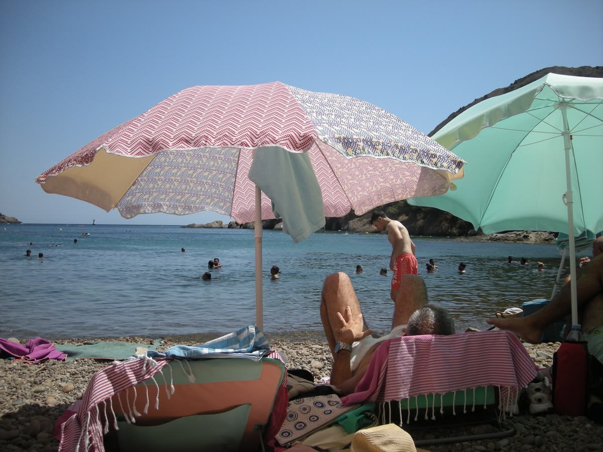

<div align="center">

<!-- PROFILE PHOTO: upload photo.png to assets/ folder in your repo -->
<!--  -->

# hi, i'm nicha 🌸

*cs @ nus · ml enthusiast · fintech builder · singapore*

[](https://linkedin.com/in/YOUR_LINKEDIN)
[](mailto:YOUR_EMAIL)
[](https://YOUR_SITE)

</div>

---

## 🌷 about me

```python
nicha = {
    "school":     "NUS Computer Science (Year 2, Merit Scholar)",
    "interning":  "Dobin — ML pipelines & transaction enrichment",
    "exchange":   "Uppsala University, Sweden (Autumn 2026)",
    "building":   "Cipher — behavioural finance ML app for SG users",
    "hobbies":    ["muay thai 🥊", "piano 🎹", "tutoring kids 📚"],
    "fun_fact":   "working toward ARSM music performance diploma",
}
```

---

## 🛠️ skills & stack

**languages**


**ml / ai**


**web & infra**


---

## 🌸 projects

| project | description | stack |
|--------|-------------|-------|
| [**Cipher**](https://github.com/mellowfarm/Cipher) | behavioural finance ML app — transaction categorisation with sentence transformers + user feedback loops | FastAPI · React · PostgreSQL · sentence-transformers |
| **MINDConnect** | web app for MINDS Singapore, built at Google Hack for Good 2026 | React · Firebase |
| **ConnectEd** | desktop tutor-student matching app | Java · JavaFX |
| **Grid Adventure** | A* search + CNN tile classifier, ~0.966 test score | Python · PyTorch |

---

## 📊 github stats

<!-- STATS CARDS: replace 'mellowfarm' with your github username if different -->
<!-- pick a theme: rose_pine, tokyonight, catppuccin_latte, dracula, etc. -->

<div align="center">


</div>

<!-- OPTIONAL: streak stats — also very cute -->
<!--  -->

---

## ✨ a little more me

🎵 &nbsp;working toward ARSM music performance diploma  
📈 &nbsp;etf investor (VWRA gang 🌍)  
🌱 &nbsp;volunteer tutor with Project CUP & New Life Stories  
🥊 &nbsp;muay thai recreationally  
🌸 &nbsp;living at Acacia College (NUS AI-focused RC)  
🇸🇪 &nbsp;heading to Uppsala, Sweden in Autumn 2026!

---

<div align="center">

*always building something · open to ml/ai internships nov 2026* 🌷

<!-- OPTIONAL: a cute footer image or gif -->
<!--  -->

</div>
